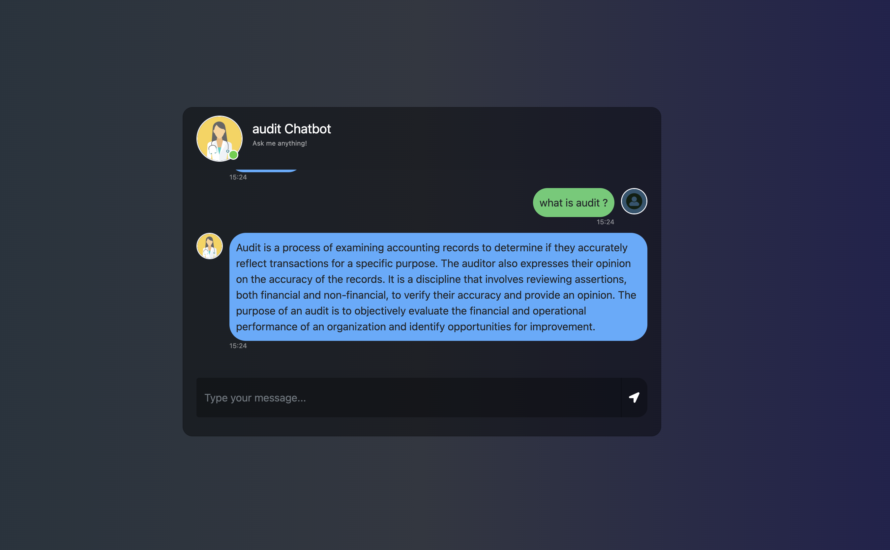
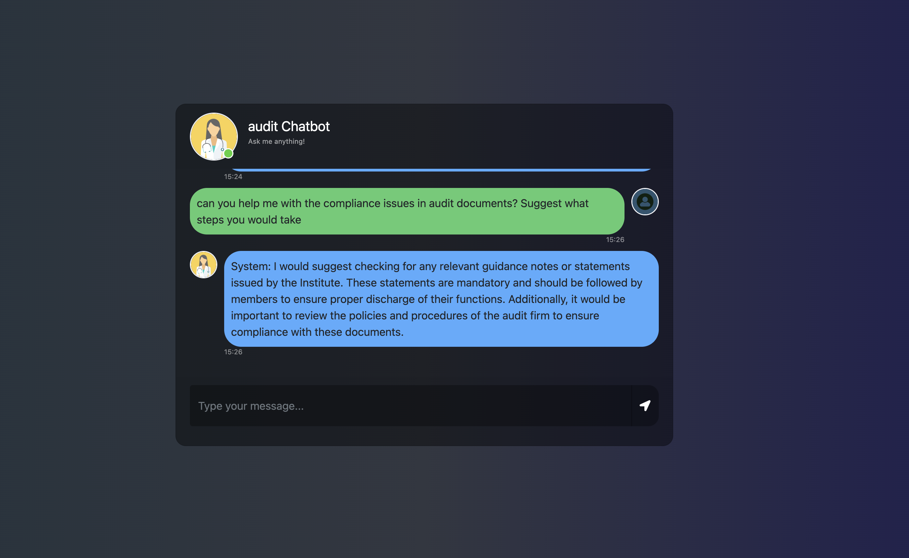
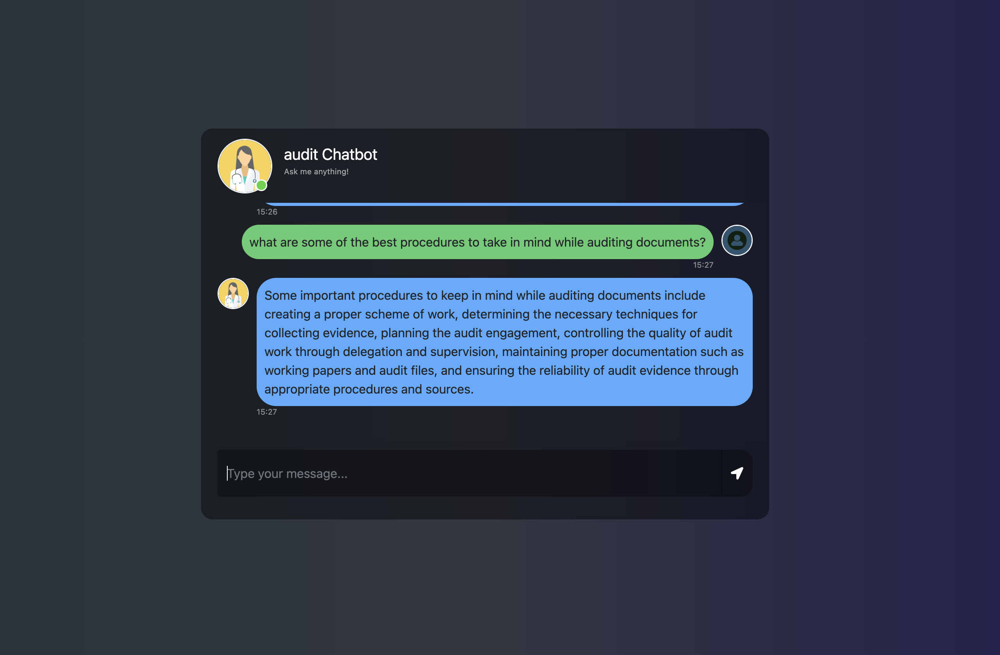
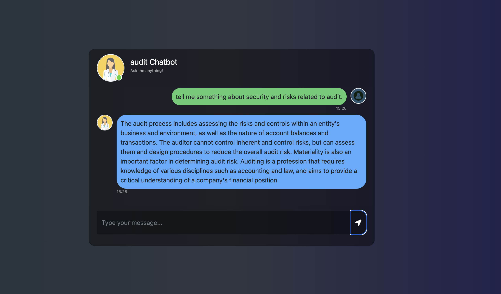
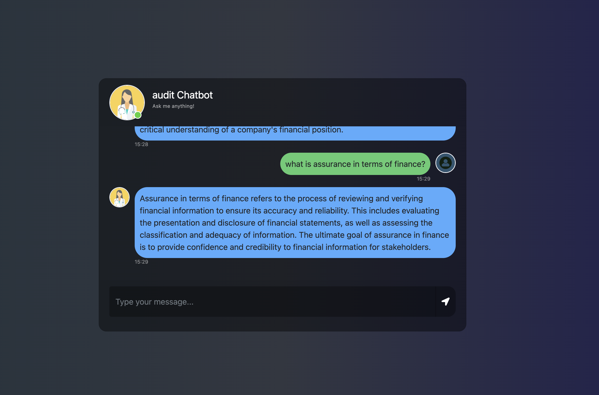

# End-to-end-AUDITING_BOT-using-GENERATIVE_AI

# Welcome to auditing_bot, a powerful web application that centralizes and automates the auditing process using cutting-edge AI tools. Built with the latest technologies, auditing_bot integrates data ingestion, VectorDB (Pinecone), and Hugging Face to provide in-depth analytics and real-time insights. This project leverages OpenAI for enhanced natural language processing and decision-making capabilities, combined with Hugging Face models to further boost the AI's ability to understand and interact with various types of data.
# With Pinecone and Hugging Face, the project implements a robust and efficient method for managing and analyzing large datasets, making it the perfect solution for modern auditing and data processing needs.


# How to run?
### STEPS:

Clone the repository

```bash
Project repo: https://github.com/
```
### STEP 01- Create a conda environment after opening the repository

```bash
conda create -n audibot python=3.10 -y
```

```bash
conda activate audibot
```


### STEP 02- install the requirements
```bash
pip install -r Recquirements.txt
```


### Create a `.env` file in the root directory and add your Pinecone & openai credentials as follows:

```ini
PINECONE_API_KEY = "xxxxxxxxxxxxxxxxxxxxxxxxxxxxx"
OPENAI_API_KEY = "xxxxxxxxxxxxxxxxxxxxxxxxxxxxx"
```


```bash
# run the following command for some installations
pip install -U cryptography

```

```bash
# run the following command to store embeddings to pinecone
python store_index.py
```

```bash
# Finally run the following command
python app.py
```

Now,
```bash
open up localhost:
```


### Techstack Used:

- Python
- LangChain
- Flask
- GPT
- Pinecone
## 🚀 Demo

### 1. **Project Overview**


---


---


---


---


---


---


    