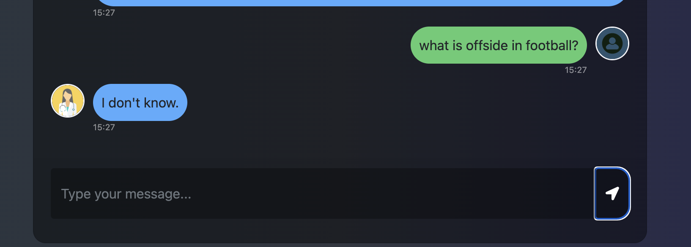

# End-to-end-AUDITING_BOT-using-GENERATIVE_AI

# Welcome to auditing_bot, a powerful web application that centralizes and automates the auditing process using cutting-edge AI tools. Built with the latest technologies, auditing_bot integrates data ingestion, VectorDB (Pinecone), and Hugging Face to provide in-depth analytics and real-time insights. This project leverages OpenAI for enhanced natural language processing and decision-making capabilities, combined with Hugging Face models to further boost the AI's ability to understand and interact with various types of data.
# With Pinecone and Hugging Face, the project implements a robust and efficient method for managing and analyzing large datasets, making it the perfect solution for modern auditing and data processing needs.

Here’s a brief description of each file and folder in your auditing_bot project:

Generative_AI_Project.egg-info: Metadata directory for the project, typically generated when creating Python packages.


setup.py: Script for packaging and distributing the project, defining dependencies and installation steps.


LICENSE: Contains the licensing information for the project.


README.md: Project documentation, typically includes an overview, installation instructions, usage, and other details.


Recquirements.txt: List of Python dependencies required for the project.


app.py: Main application file, likely where the core logic or server (like a Flask or FastAPI app) runs.


data: Directory that might store datasets, input data, or related files.
images: Contains images used in the project, possibly for the demo, documentation, or UI.


research: Likely holds research notes, reference materials, or experimental code.


src: Source code directory, where most of the project's core logic and modules are implemented.


static: Contains static files like CSS, JavaScript, and other assets for the web app.


store_index.py: Script likely related to indexing data, possibly for VectorDB like Pinecone.


templates: Directory for HTML templates used in the web application.


templates.py: Python script, possibly managing or rendering templates dynamically.


test.py: Script for testing project components, including unit tests or integration tests.


# How to run?
### STEPS:

Clone the repository

```bash
Project repo: https://github.com/
```
### STEP 01- Create a conda environment after opening the repository

```bash
conda create -n audibot python=3.10 -y
```

```bash
conda activate audibot
```


### STEP 02- install the requirements
```bash
pip install -r Recquirements.txt
```


### Create a `.env` file in the root directory and add your Pinecone & openai credentials as follows:

```ini
PINECONE_API_KEY = "xxxxxxxxxxxxxxxxxxxxxxxxxxxxx"
OPENAI_API_KEY = "xxxxxxxxxxxxxxxxxxxxxxxxxxxxx"
```


```bash
# run the following command for some installations
pip install -U cryptography

```

```bash
# run the following command to store embeddings to pinecone
python store_index.py
```

```bash
# Finally run the following command
python app.py
```

Now,
```bash
open up localhost:
```


### Techstack Used:

- Python
- LangChain
- Flask
- OpenAI
- Pinecone
## 🚀 Demo

### 1. **Project Overview**


---


---


---


---


---


---


    